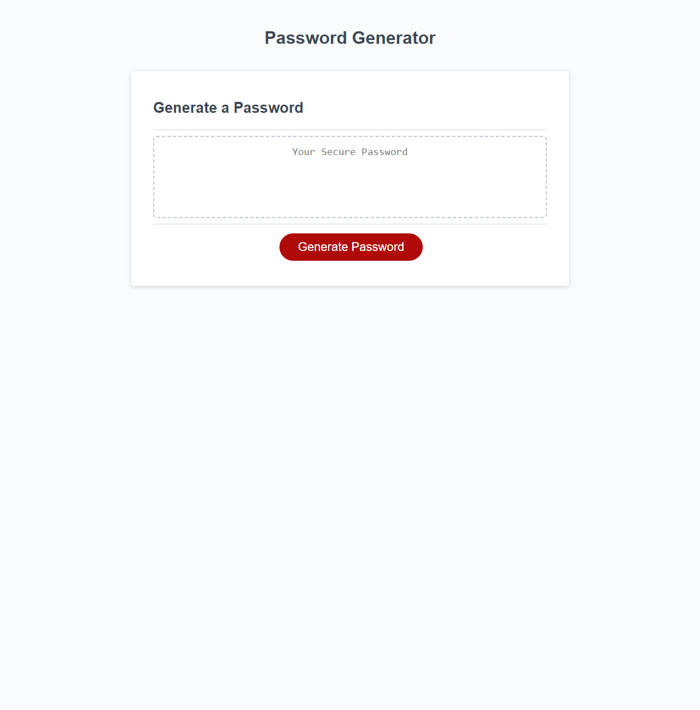

# Password Generator

## Description

This web app is a password generator tool. It will generate a password for the user based on the following criteria chosen by the user.

- Password length
- Whether it should include numbers
- Whether it should include lower cases
- Whether it should include upper cases
- Whether it should include special characters

This tool will generate a unique password every time. Giving the user better security for their accounts. 

## Table of Contents (Optional)

## Installation

## Usage

https://sjuan634.github.io/password-generator/

## Credits

## License

## Badges

## Features

## How to Contribute

## Tests
